# ready-enterprise-ai-platform

**Reference implementation for the session _"Beyond the Agent: Enterprise AI Architecture Patterns and Production Readiness."_**

> The specialized model finds the defect. The Enterprise AI platform proves what happened and governs what happens next.

---

## The thesis this repository exists to make falsifiable

Agents are not the architecture. Frontier models are not the architecture. **The platform is the product.**

That is easy to say from a stage and hard to demonstrate, so this repository is the demonstration. It implements one governed business transaction end to end — a manufacturing quality and maintenance workflow — and it is built so that the interesting claims can be *checked* rather than believed:

| Claim | Where it is enforced | How you can check it |
| --- | --- | --- |
| The model never changes an authoritative value | `packages/policy_engine` runs in code; `contracts.Recommendation` has no field that can carry a verdict | `tests/unit/test_policy_engine.py` |
| Retrieved content is untrusted input | `packages/retrieval` sanitisation + entitlement filter applied at query time | `tests/security/test_prompt_injection.py` |
| Exactly one component may mutate a system of record | `packages/connectors.writer` is the sole holder of the write path | `tests/contract/test_sole_writer.py` |
| A consequential action requires a bound human approval | Writer verifies an approval whose fingerprint matches the proposal byte-for-byte | `tests/unit/test_scoped_writer.py` |
| Every route decision is explainable afterwards | `contracts.RouteDecision` records candidates, exclusions, reason codes, policy version | `tests/unit/test_model_router.py` |
| The whole transaction is reconstructable | Hash-chained `contracts.AuditReceipt` + one correlation ID across every span | `tests/unit/test_audit_receipt.py` |

This is **not** an anti-LLM project. Frontier models, small models, CNN/YOLO-class detectors, retrieval, rules engines, agents and deterministic code are complementary components. The architectural question this repository answers is not *"how do I use the largest model?"* but:

> **What architecture delivers the required business outcome at the required latency, accuracy, throughput, security, governance, reliability and cost profile?**

---

## Five-minute quickstart (no Azure subscription, no credentials, no network)

Requires Python 3.12+ and [`uv`](https://docs.astral.sh/uv/).

```bash
git clone https://github.com/honestypugh2/ready-enterprise-ai-platform.git
cd ready-enterprise-ai-platform

uv venv --python 3.12 .venv
source .venv/bin/activate          # Windows: .venv\Scripts\activate
uv sync --extra dev

# Run the complete governed flow against deterministic fixtures
reap demo run --scenario critical-defect
```

You will see the twelve workflow steps execute, a deterministic policy **reject** an unsafe action, an approval gate hold the write, and a hash-chained audit receipt printed at the end.

Start the API and the demo UI:

```bash
make dev            # FastAPI on :8000, docs at /docs
make web            # Vite dev server on :5173
```

Run the checks that gate a release:

```bash
make test           # unit + contract + security suites
make eval           # evaluation gates with thresholds
make lint typecheck # ruff + mypy --strict
```

`LOCAL_MOCK` is the default mode and it is *enforced*, not merely documented: `PlatformSettings` refuses to start in local mode if any plane is pointed at a cloud dependency, and refuses to start with `dry_run=false` on the writer.

---

## The reference flow

```mermaid
flowchart LR
    subgraph SIG["Signal"]
        A[Synthetic frame] --> B["CNN / YOLO-compatible detector<br/>packages/detector"]
    end
    B --> C["PredictionCreated event<br/>packages/events"]
    C --> D["Policy-aware router<br/>packages/model_router"]
    D --> E["Governed retrieval<br/>packages/retrieval"]
    E --> F["Reasoning: explain only<br/>packages/reasoning"]
    F --> G["Deterministic policy<br/>packages/policy_engine"]
    G --> H["Human approval<br/>packages/approvals"]
    H --> I["Sole scoped writer<br/>packages/connectors"]
    I --> J["Hash-chained audit receipt<br/>packages/audit"]
    J --> K["Evaluation + cost per completed task<br/>packages/evaluation, packages/cost_attribution"]

    classDef model fill:#1f4e79,stroke:#0d2a44,color:#fff
    classDef platform fill:#2e75b6,stroke:#1f4e79,color:#fff
    class B model
    class C,D,E,F,G,H,I,J,K platform
```



The detector is deliberately one small box. Everything to the right of it is the platform, and that proportion is the argument.

## Nine planes, one product

| Plane | Package | Bounded responsibility |
| --- | --- | --- |
| Data & knowledge | `retrieval` | Authority, entitlement, freshness, citations |
| Specialized model | `detector`, `predictive_models` | Detect, classify, forecast, score |
| Foundation model | `reasoning` | Explain and summarise **only** |
| Routing & policy | `model_router` | Which component answers, and why |
| Agent & workflow | `workflows` | Bounded, explicit, terminating orchestration |
| Enterprise action | `connectors`, `approvals` | Supervised, idempotent, single-writer mutation |
| Governance & security | `policy_engine`, `security`, `audit` | Deterministic verdicts and provable evidence |
| Evaluation & observability | `evaluation`, `observability` | Release gates, traces, quality telemetry |
| Infrastructure & operations | `infra/`, `cost_attribution` | Landing zone, gateway, unit economics |

A plane may depend on `contracts`. It may not import another plane's internals — a rule enforced by `tests/contract/test_plane_boundaries.py`.

---

## Three execution modes

| Mode | `REAP_MODE` | Requires | Default |
| --- | --- | --- | --- |
| Local mock | `local_mock` | Nothing. No subscription, no credential, no network. | ✅ |
| Azure development | `azure_dev` | Azure subscription, managed identity or `az login` | — |
| Production reference | `production` | Full landing zone, private endpoints, approvals wired | — (disabled by default) |

Azure mode is opt-in per plane, so you can connect retrieval to Azure AI Search while leaving reasoning mocked. See [`docs/operations/execution-modes.md`](docs/operations/execution-modes.md).

---

## What is real, what is mocked

Honesty about status is a feature of this repository, not a caveat buried at the bottom. **[`IMPLEMENTATION_STATUS.md`](IMPLEMENTATION_STATUS.md)** records, for every capability: complete / partial / mocked / planned / preview-dependent / not implemented, plus the validation actually performed and the production implication of the gap.

Three statements that apply everywhere:

- **No fabricated numbers.** No benchmark, accuracy figure, latency claim, Azure price or customer outcome appears in this repository unless it was measured locally and is labelled as a demonstration measurement.
- **No real business records.** Every connector is dry-run by default. Nothing here creates a ticket, order or work order in a live system.
- **No real personal data.** All fixtures are synthetic. Identities are synthetic role abstractions.

`READY AI` is an **original field framework** created for this session. It is not an official Microsoft standard.

---

## Documentation

| Start here | For |
| --- | --- |
| [`docs/architecture/overview.md`](docs/architecture/overview.md) | The nine planes and why they are separated |
| [`docs/demo/runbook.md`](docs/demo/runbook.md) | The five-minute demo, with a no-network fallback |
| [`docs/presentation-mapping/README.md`](docs/presentation-mapping/README.md) | Every slide message → component → test → demo step |
| [`docs/security/threat-model.md`](docs/security/threat-model.md) | Prompt injection, excessive agency, exfiltration, replay |
| [`docs/evaluations/framework.md`](docs/evaluations/framework.md) | Datasets, graders, thresholds, release gates |
| [`docs/operations/production-readiness.md`](docs/operations/production-readiness.md) | READY AI scorecard and the release gate |
| [`docs/field-positioning/README.md`](docs/field-positioning/README.md) | AI Apps / Data / Infrastructure motions |
| [`docs/adr/`](docs/adr/) | Why each structural decision was made |
| [`docs/architecture/reuse-and-attribution.md`](docs/architecture/reuse-and-attribution.md) | Provenance of reused patterns |

---

## Contributing & security

- [`CONTRIBUTING.md`](CONTRIBUTING.md) — development workflow and the definition of done
- [`SECURITY.md`](SECURITY.md) — reporting process and supported scope
- [`AGENTS.md`](AGENTS.md) — conventions for AI coding agents working in this repository

## License

[MIT](LICENSE). Patterns reused from the sibling repositories listed in [`docs/architecture/reuse-and-attribution.md`](docs/architecture/reuse-and-attribution.md) are MIT-licensed and attributed there.
