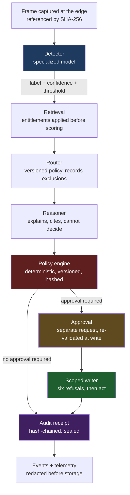
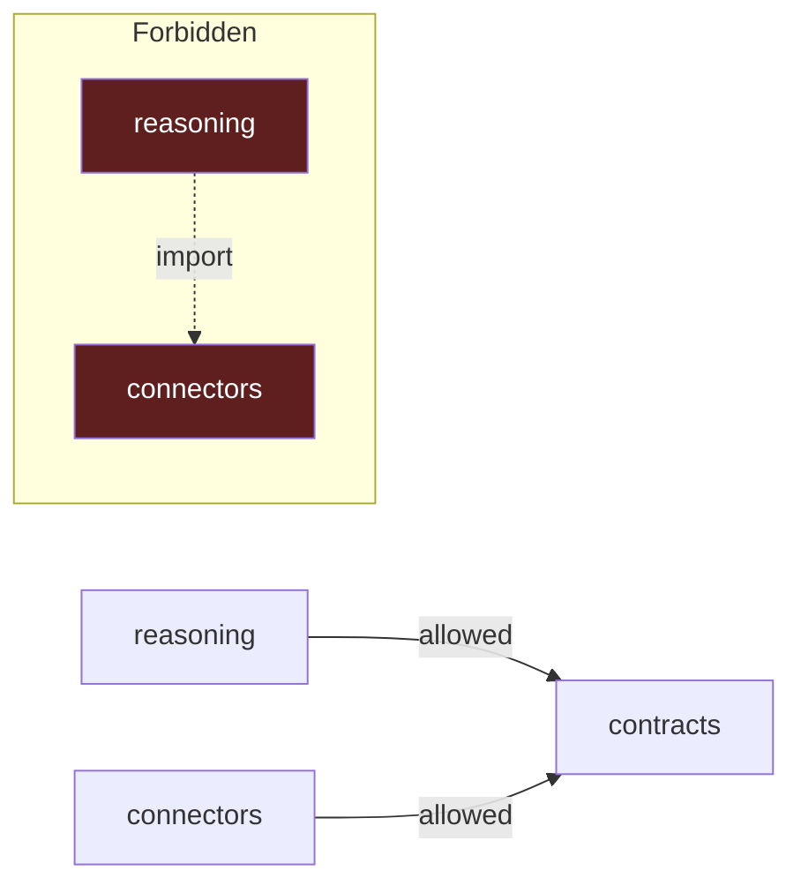
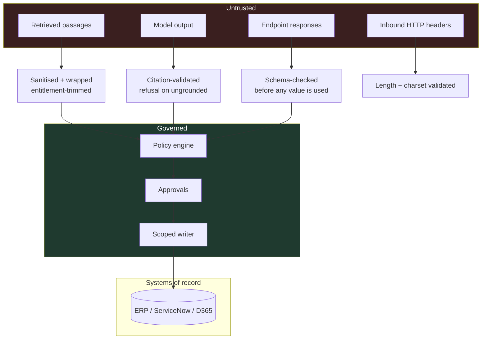

# Architecture overview

> **Agents are not the architecture.** Successful enterprise AI programs are
> built on platforms, governance, retrieval, security, evaluation, operations,
> and measurable business outcomes.

This document explains the nine planes, why they are separated, and where each
claim is enforced.

## The transaction

One inspection, end to end. Twelve explicit steps, not an agent loop. The
sequence is known in advance, so runtime discovery would add cost and failure
surface without adding capability.

Two properties matter more than the individual steps:

**The model never writes, and the writer never reasons.**

Everything between those two facts is evidence, policy and supervision.

## The nine planes

| Plane | Responsibility | It cannot |
|---|---|---|
| `contracts` | Versioned types every plane shares | Depend on anything |
| `platform_config` | Execution modes and settings | Permit a cloud provider in local mode |
| `detector` | Produce a signal from a frame | Decide what happens next |
| `predictive_models` | Forecast a series forward | Emit a point estimate without an interval |
| `retrieval` | Return governed evidence | Return a passage past an entitlement |
| `reasoning` | Explain, with citations | Decide, approve, or write |
| `policy_engine` | Decide the disposition | Read passage prose |
| `approvals` | Hold a decision by a named human | Let the requester approve their own proposal |
| `connectors` | Mutate a system of record | Act without a bound, verified approval |

Plus `audit`, `events`, `observability`, `security`, `cost_attribution`,
`evaluation`, `model_router`, `readyai` and `workflows` as supporting planes.

### Why planes rather than layers

A layer is about *when* code runs. A plane is about *what a component is allowed
to know*. The distinction matters because the security properties here are
statements about knowledge: the reasoning plane cannot cause a write **because
it has no path to a connector**, not because it is called earlier.

That is enforced structurally. `tests/contract/test_plane_boundaries.py` parses
the import graph and fails the build if a plane reaches past its declared
dependencies.

## Trust boundaries

Every arrow into *Governed* crosses a boundary where the input is validated.
Nothing crosses from *Untrusted* directly to *Systems of record*.

## The six refusals

`ScopedWriter.execute()` refuses six times before anything changes:

1. Policy allowed this transaction
2. The action kind is in the permitted set
3. The approval verifies against **this** proposal fingerprint and policy decision
4. The connector supports the action
5. The idempotency key has not already been applied
6. Dry run is off

`ActionRequest` requires `approval_id`, `proposal_fingerprint`,
`policy_decision_id` and `idempotency_key` — so an unbound write **cannot be
expressed in the type system**.

The sole-writer contract test parses the import graph and fails if another
component gains a connector path.

## Execution modes

| Mode | Detector | Retrieval | Reasoning | Writes |
|---|---|---|---|---|
| `local_mock` | Hash-seeded fixture | Local corpus | Template engine | Always dry run, **enforced** |
| `azure_dev` | AML endpoint | Azure AI Search | Foundry | Configurable |
| `production` | AML endpoint | Azure AI Search | Foundry | Configurable, gateway required |

See [operations/execution-modes.md](../operations/execution-modes.md).

## Where each claim is enforced

| Claim | Enforced by |
|---|---|
| A plane cannot reach past its boundary | `tests/contract/test_plane_boundaries.py` |
| Only one component may write | `tests/contract/test_sole_writer.py` |
| Reasoning cannot decide | `Recommendation` has no verdict field; boundary test |
| Six refusals, in order | `tests/unit/test_scoped_writer.py` + `inspect.getsource` |
| Entitlements before scoring | `tests/security/test_authorization.py` |
| Injection cannot move a verdict | `tests/security/test_prompt_injection.py` |
| Redaction cannot be bypassed | `tests/security/test_telemetry_redaction.py` |
| Local mode cannot reach the cloud | `platform_config` validator |
| Every scenario's audit chain verifies | `tests/integration/` + `ci.yml` |

## Further reading

- [Threat model](../security/threat-model.md)
- [Authorization model](../security/authorization-model.md)
- [Evaluation framework](../evaluations/framework.md)
- [Execution modes](../operations/execution-modes.md)
- [Production readiness](../operations/production-readiness.md)
- [Reuse and attribution](reuse-and-attribution.md)
