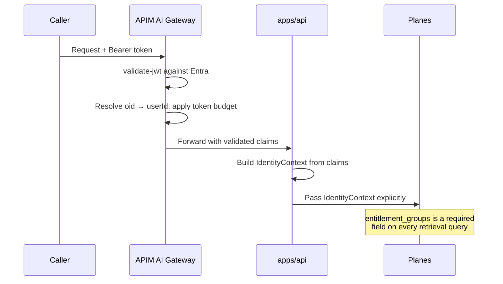

# Authorization model

Three separate controls, tested separately, because they fail separately.

1. **Retrieval** trims by entitlement and classification before scoring
2. **Approvals** enforce role match and separation of duties
3. **The writer** re-verifies the binding at execution time

Being authenticated is not being authorised. Being authorised at proposal time
is not being authorised at write time.

## What does not exist here

**There is no authentication in this repository.**

`apps/api/dependencies.py::get_identity` reads an `x-demo-role` header and
returns a synthetic persona. It exists so the entitlement demonstration can show
two callers getting different, correct answers from one index — offline, with no
identity provider.

It is labelled in the function's own docstring, and a test asserts the label is
still there:

```python
def test_the_header_based_identity_is_documented_as_a_demo_control() -> None:
    doc = inspect.getdoc(get_identity) or ""
    assert "not authentication" in doc.lower()
```

That test exists because a labelled shortcut with no test eventually loses its
label.

## Production identity



`IdentityContext` is a frozen dataclass built from **validated claims**. It is
never constructed from model output and never from a request body.

Replacing `get_identity` is the single change. Everything downstream already
takes an `IdentityContext`.

## Control 1 — retrieval entitlements

`RetrievalQuery.entitlement_groups` is **required**. A retriever that can be
called without entitlements will eventually be called without them.

**Empty means entitled to nothing**, never entitled to everything. The default
that has caused real breaches is "no groups means no filter".

Trimming happens **before scoring**, for two reasons:

- A restricted document would otherwise consume a top-k slot, so an entitled caller silently gets fewer results.
- Document existence leaks through score distributions and result counts.

`RetrievalResult.trimmed_count` reports how many were removed, so a caller can
distinguish "nothing matched" from "nothing you may see matched".

Classification is a **second, independent axis**. Being in the group is not
sufficient: a caller operating at `internal` cannot pull a `confidential`
passage from a corpus they can otherwise read.

**Tests:**

| Property | Test |
|---|---|
| Two identities, one index, different correct answers | `test_two_identities_get_different_answers_from_one_index` |
| Empty entitlements returns nothing | `test_empty_entitlements_means_entitled_to_nothing` |
| Classification applies independently of groups | `test_classification_ceiling_is_applied_independently_of_groups` |
| Filtering is before top-k, not after | `test_trimming_happens_before_scoring_not_after_ranking` |

The fourth asks for `top_k=1` and requires one *real* result — it fails if
filtering ever moves after ranking.

### Production note

The local retriever filters in process. Azure AI Search should use index-side
security filters so the trim happens in the service. **The property must survive
that change:** a document the caller may not see is never ranked.

## Control 2 — approval authorization

| Rule | Why |
|---|---|
| Role must match `policy.approver_role` | A defect requiring a plant manager cannot be approved by a line operator |
| Requester ≠ approver | Separation of duties. The control an auditor asks about first |
| Dual control needs **two distinct principals** | Two clicks from one person is one person |
| Approvals expire | An approval is a decision about a moment, not a standing permission |
| Approvals can be revoked | Line conditions change between proposal and write |

Dual control is the one most often implemented decoratively. Here
`_resolve_state` counts **distinct** principals and returns `PENDING` until
there are two:

```python
approvers = {d.approver_principal_id for d in decisions if d.state.permits_write}
return ApprovalState.APPROVED if len(approvers) >= 2 else ApprovalState.PENDING
```

An earlier implementation used `ApprovalState.MODIFIED` to mean "awaiting the
second approver" — a misuse of the enum that made the state machine lie. It was
corrected to allow a `PENDING → PENDING` self-transition.

### The approval surface

An approver asked to click "approve" on a sentence is a rubber stamp with a name
attached. `ApprovalEvidence` carries **five things as data**: citations,
authoritative values, policy reason codes, the expected downstream effect, and a
detection summary — plus the proposal fingerprint and the expiry.

## Control 3 — write-time re-verification

`verify_for_write` checks, in order, that the approval exists, matches **this**
proposal fingerprint, binds to **this** policy decision, has not expired, and is
in a state that permits a write.

Each failure mode is explicit and separately tested. The fingerprint check is
what makes a modified proposal unusable with an old approval.

`inspect.getsource` asserts that `verify_for_write` appears **before**
`_attempt_write` in the writer. A check after the write is a log entry, not a
control.

## Workload identity

Every component authenticates as itself. There is no shared service principal,
no secret in configuration, and no code path that accepts a connection string.

| Identity | May |
|---|---|
| `reap-api` | Read evidence, query the index, call models, send events |
| `reap-worker` | Receive events, **write audit blobs** |
| `reap-scoped-writer` | Call the system-of-record connector |
| `reap-reasoning-client` | Call the model endpoint. **No write permission anywhere** |

A shared principal makes an audit log say "the platform did it". Separate
identities are what make attribution possible — and what keep a compromised
reasoning path holding permissions that cannot mutate anything.

Assignments are in `infra/modules/rbac.bicep`, by role definition **id** rather
than name, because a name lookup can silently resolve differently in another
cloud. **That module has never been deployed.**

## Gaps

| Gap | Impact |
|---|---|
| No authentication | The largest. Documented, not undiscovered |
| Approvals not durably stored | A restart loses pending approvals |
| Transaction state is per-replica | The approval flow fails on a second replica |
| RBAC never deployed | Least privilege is asserted by a template, not observed |
| No policy-change authorization | Whoever can write the policy file changes what is permitted |
