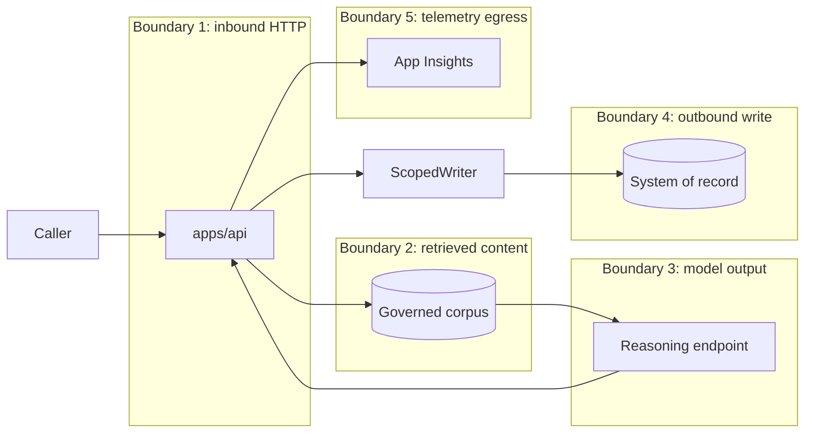

# Threat model

Scope: the governed quality workload in this repository. Method: STRIDE per
trust boundary, plus the OWASP Top 10 for LLM Applications.

Every mitigation below names the test that fails if it stops holding. A
mitigation with no test is listed as **unmitigated**, because that is what it
is.

## Assets

| Asset | Why it matters |
|---|---|
| Systems of record | A write is the only thing here with real-world consequence |
| Approval records | The authorisation the whole write path depends on |
| Audit receipts | The evidence that any of this happened as claimed |
| Governed corpus | Carries entitlement- and classification-scoped content |
| Policy document | Defines what the platform is permitted to do |
| Telemetry | Contains prompts, passages and tool arguments by construction |
| Workload identities | Hold the permissions everything else is scoped by |

## Trust boundaries

## LLM01 — Prompt injection

**Threat.** A retrieved passage instructs the model to downgrade a severity,
claim approval was granted, or invoke a tool.

**Mitigation — architectural, not lexical.**

The load-bearing control is that **policy reads detection signals and evidence
*metadata*, never passage prose**. No sentence in any document can change a
disposition, because the disposition is not computed from prose.

Supporting, weaker controls: content is wrapped in a non-forgeable delimiter,
control characters and delimiter-spoofing sequences are stripped, and
injection-shaped signals are recorded at index time as a finding about the
corpus.

**Enforced by** `tests/security/test_prompt_injection.py`, which runs the
adversarial corpus through the real workflow and asserts the verdict is
identical to the benign case.

**Residual risk — stated plainly.** The heuristics do **not** reliably detect
injection, and the test suite asserts that: `test_an_unseen_phrasing_is_not_claimed_to_be_caught`
demonstrates a paraphrase slipping through. Containment is the architecture
above; the heuristics only reduce noise.

## LLM02 — Insecure output handling

**Threat.** Model output is treated as a command.

**Mitigation.** `Recommendation` has **no field for a verdict, an action or an
approval**. The contract cannot express one. A non-refusing recommendation must
cite at least one retrieved passage, validated by `validate_citations`.

**Enforced by** `tests/contract/test_plane_boundaries.py::TestReasoningCannotDecide`.

## LLM06 — Sensitive information disclosure

**Threat.** A prompt, passage or credential reaches telemetry, an audit receipt
or a log.

**Mitigation.** Redaction in the formatter, before storage — by key and by
value pattern. Audit attributes are redacted **on the way in**, so a receipt
never holds the value. Exception logging records type and message, not the
traceback. Evidence passages are not returned on the API wire; citations
reference the evidence store.

**Enforced by** `tests/security/test_telemetry_redaction.py`.

**Residual risk.** The key list is a denylist. A new sensitive field is
protected only by the value-pattern rules until it is added.

## LLM08 — Excessive agency

**Threat.** The system takes an action nobody authorised.

**Mitigation.** Six refusals in `ScopedWriter`, an `ActionRequest` that cannot
be constructed without its bindings, dry run defaulting to on, an approval that
is re-verified at write time against the proposal fingerprint, and a step
budget plus kill switch on the workflow.

**Enforced by** `tests/contract/test_sole_writer.py`,
`tests/unit/test_scoped_writer.py`,
`infra/monitor/queries/unapproved-write-attempts.kql` and a Sev-0 alert.

## Spoofing — caller identity

**Threat.** A caller claims to be someone else.

**Status: UNMITIGATED in this repository.** There is no authentication. The API
selects a synthetic persona from the `x-demo-role` header. This is labelled in
`apps/api/dependencies.py`, in `SECURITY.md` and in `IMPLEMENTATION_STATUS.md`.

**Production mitigation.** Entra token validation at the gateway; the identity
is built from validated claims and the header path is removed. See
[authorization-model.md](authorization-model.md).

## Tampering — the policy document

**Threat.** Someone edits the policy to permit an action.

**Partial mitigation.** Every decision records the policy version and the
SHA-256 of the file, so a changed policy is *detectable after the fact*.

**Status: UNMITIGATED for prevention.** There is no signing and no
change-control workflow. **Whoever can write the policy file can change what
the platform is allowed to do.** This is the most significant unmitigated risk
in the design.

## Repudiation

**Threat.** "The AI did it" with nothing to reconstruct.

**Mitigation.** Hash-chained audit receipts, sealed for failed and halted
transactions as well as successful ones, binding prediction, policy decision,
approval and action receipt ids. `verify_chain()` is asserted for all seven
scenarios in CI.

**Residual risk.** Local storage is write-once by convention. The immutability
policy exists in `infra/modules/storage.bicep` and **has never been deployed**.

## Information disclosure — cross-entitlement

**Threat.** A caller receives evidence they are not entitled to.

**Mitigation.** Entitlements are required on every query, applied **before**
scoring, with an independent classification ceiling. Empty entitlements means
entitled to nothing.

**Enforced by** `tests/security/test_authorization.py`, including a test that
fails if filtering ever moves after ranking.

## Denial of service

**Threat.** Unbounded consumption.

**Mitigation.** Per-user token limits at the gateway, body size limit, step
budget, per-stage timeouts, bounded retries, and a kill switch.

**Residual risk.** In-process rate limiting is per-replica and is a
demonstration guard. The real control is the gateway, which is off by default
outside prod.

## Elevation of privilege

**Threat.** A compromised component gains permissions it should not have.

**Mitigation.** One managed identity per component. The API can read evidence
and call models; only the worker may write blobs; the reasoning path holds no
write permission anywhere. Local auth is disabled on Search, Foundry, Service
Bus, Storage and App Insights ingestion.

**Enforced by** `infra/modules/rbac.bicep` — **never deployed**.

## Supply chain

**Mitigation.** `uv.lock` pins with hashes; `pip-audit --strict` and
`npm audit` in CI; CodeQL across Python, TypeScript and Actions; SBOM published
on every push to `main`; Dependabot with security updates ungrouped so they
arrive alone.

## Summary of unmitigated risks

| Risk | Status |
|---|---|
| Caller identity spoofing | **No authentication.** Documented, not undiscovered |
| Policy tampering | Detectable after the fact; **no prevention** |
| Approval loss on restart | In-memory or file store; not durable |
| Audit deletion | Immutability written in Bicep, never deployed |
| Prompt injection by novel phrasing | Not detected; contained architecturally |
| Real connector failure modes | Unbuilt and therefore unknown |

These are ordered the same way in `IMPLEMENTATION_STATUS.md`. If this document
and that one ever disagree, that one is authoritative.
